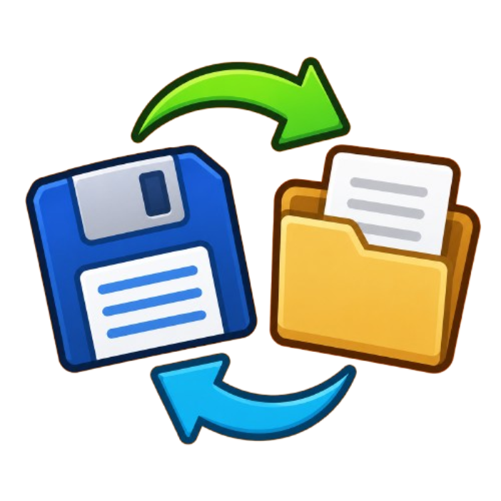

<h1 align="center">

Game Save Manager
</h1>

Save the towers, cash, and lives you have in a game to a file, then reload them
into a fresh game. Save, leave, start a new game, and pull your old setup back in.
Give each save a name, organize them into folders, and share them with
friends as a single copy-paste code or as exported files.
Saves live in folders so big collections stay tidy. The default folder is
General. Make new ones with the **+** button in the catalog (or the
New folder button in the save window), and switch between them with the
`<` / `>` buttons in the catalog or on the on-screen panel. On disk:
`...\MelonLoader\UserData\TowerSaveStates\<Folder>\<Name>.json`. Saves from older
versions (loose files in the root) show up under a Legacy folder so they still load.

